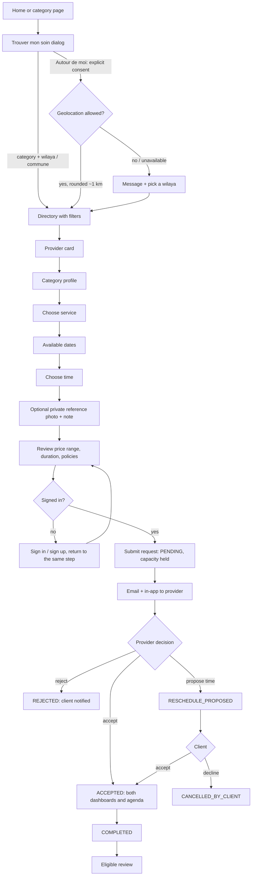
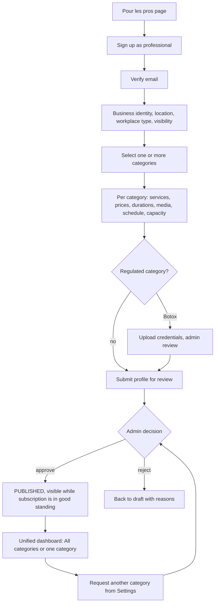
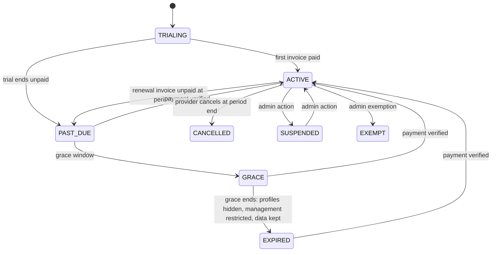
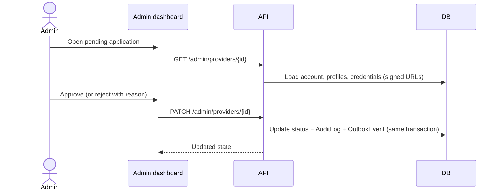

# User flows

## Client: discover and request

```mermaid
flowchart TD
    A[Home or category page] --> B[Trouver mon soin dialog]
    B -->|category + wilaya / commune| D[Directory with filters]
    B -->|Autour de moi: explicit consent| C{Geolocation allowed?}
    C -->|yes, rounded ~1 km| D
    C -->|no / unavailable| B2[Message + pick a wilaya] --> D
    D --> E[Provider card] --> F[Category profile]
    F --> G[Choose service] --> H[Available dates] --> I[Choose time]
    I --> J[Optional private reference photo + note]
    J --> K[Review price range, duration, policies]
    K --> L{Signed in?}
    L -->|no| M[Sign in / sign up, return to the same step] --> K
    L -->|yes| N[Submit request: PENDING, capacity held]
    N --> O[Email + in-app to provider]
    O --> P{Provider decision}
    P -->|accept| Q[ACCEPTED: both dashboards and agenda]
    P -->|reject| R[REJECTED: client notified]
    P -->|propose time| S[RESCHEDULE_PROPOSED] --> T{Client}
    T -->|accept| Q
    T -->|decline| U[CANCELLED_BY_CLIENT]
    Q --> V[COMPLETED] --> W[Eligible review]
```

## Professional: onboarding and multiple categories

```mermaid
flowchart TD
    A[Pour les pros page] --> B[Sign up as professional]
    B --> C[Verify email]
    C --> D[Business identity, location, workplace type, visibility]
    D --> E[Select one or more categories]
    E --> F[Per category: services, prices, durations, media, schedule, capacity]
    F --> G{Regulated category?}
    G -->|Botox| H[Upload credentials, admin review]
    G -->|no| I[Submit profile for review]
    H --> I
    I --> J{Admin decision}
    J -->|approve| K[PUBLISHED, visible while subscription is in good standing]
    J -->|reject| L[Back to draft with reasons]
    K --> M[Unified dashboard: All categories or one category]
    M --> N[Request another category from Settings] --> J
```

## Subscription lifecycle

```mermaid
stateDiagram-v2
    [*] --> TRIALING
    TRIALING --> ACTIVE: first invoice paid
    TRIALING --> PAST_DUE: trial ends unpaid
    ACTIVE --> PAST_DUE: renewal invoice unpaid at period end
    PAST_DUE --> ACTIVE: payment verified
    PAST_DUE --> GRACE: grace window
    GRACE --> ACTIVE: payment verified
    GRACE --> EXPIRED: grace ends: profiles hidden, management restricted, data kept
    EXPIRED --> ACTIVE: payment verified
    ACTIVE --> CANCELLED: provider cancels at period end
    ACTIVE --> SUSPENDED: admin action
    SUSPENDED --> ACTIVE: admin action
    ACTIVE --> EXEMPT: admin exemption
```

## Admin: approve a provider

```mermaid
sequenceDiagram
    actor Admin
    participant UI as Admin dashboard
    participant API
    participant DB
    Admin->>UI: Open pending application
    UI->>API: GET /admin/providers/{id}
    API->>DB: Load account, profiles, credentials (signed URLs)
    Admin->>UI: Approve (or reject with reason)
    UI->>API: PATCH /admin/providers/{id}
    API->>DB: Update status + AuditLog + OutboxEvent (same transaction)
    API-->>UI: Updated state
```
